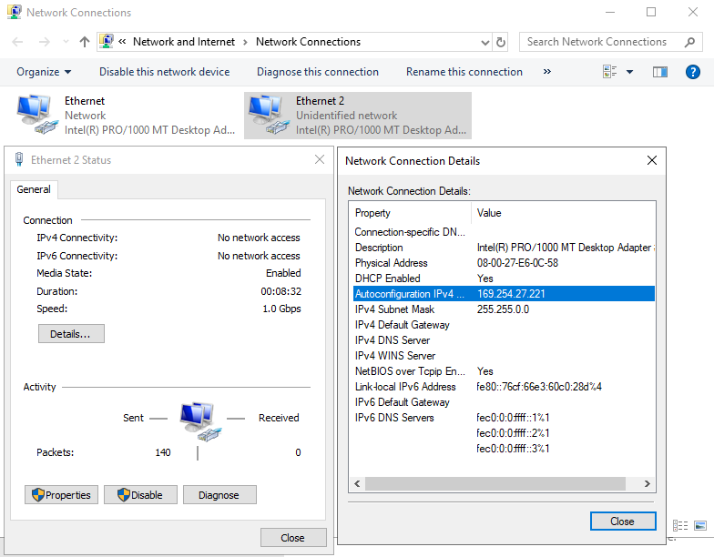
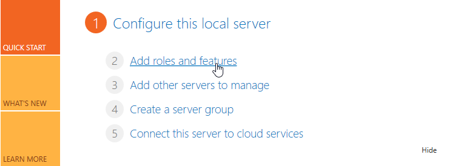
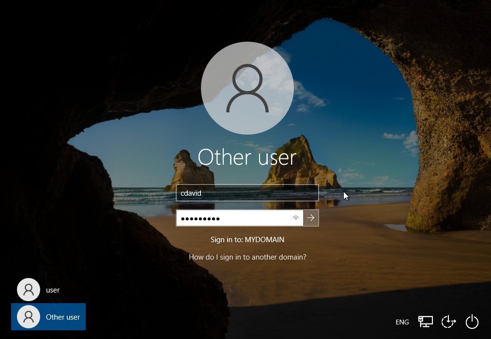

# Microsoft Active Directory Lab
--- 

Credit goes to Josh Madakor for this lab! You can find his video [here](https://www.youtube.com/watch?v=MHsI8hJmggI&list=PL_MvTIq1Tl-X04__sDhuQ89qo-g72DaBt&index=4).

### Tools and Requirements
1. VirtualBox
2. [Windows Server 2019 ISO](https://www.microsoft.com/en-us/evalcenter/download-windows-server-2019)
3. [Windows 10 ISO](https://www.microsoft.com/en-us/software-download/windows10)
4. Directory service: Active Directory Domain Services (AD DS)
5. [PowerShell Script](https://github.com/joshmadakor1/AD_PS)

## Setting up Windows Server 2019 as a Domain Controller

**Hardware**
- 2048 MB
- 2 CPUs

**Virtual Hard Disk**
- 50 GB

**Settings**
- Network
	- Adapter 1 > NAT
	- Adapter 2 > Internal Network

### Launch the Windows 2019 Server to continue set up
- Windows Server 2019 Standard Evaluation (Desktop Experience)
- Custom: Install Windows only (advanced)
- Configure an Administrator account
	- U: Administrator
	- P: AdminPass
### Configuring Internal and External NICs
- Go to the Network Status screen in settings and change connection properties
- You will not have internet access because the adapter is looking for the DHCP server that we have not configured yet

- Rename Ethernet to **__INTERNET__**
- Rename Ethernet2 to **X_INTRANET_X**

- Right Click on **X_INTRANET_X** -> Properties
- Internet Protocol Version 4 (TCP/IP4) -> Properties -> Set the IP, Subnet mask, and DNS Server
- The server will use itself as the DNS server because installing AD automatically installs DNS

### Install Active Directory Domain Services and Create a Domain

#### Installing AD DS
- Click add roles and features

- Select your server

Under Server Roles check Active Directory Domain Services

Install!

#### Creating Your Domain

- Click on **Promote this server to a domain controller**

- Change the deployment option to **Add new forest** and name the domain

- Set the password for your domain controller

- Click **Next** until you get to the Prerequisites Check an click install

#### Create an admin user account
- Navigate to Active Directory Users and Computers
 

- Right click **mydoimain.com** and add a new **Organizational Unit**
 
- Name the Org Unit **__ADMINS**
##### Add new users to the Organization unit

- Right click **__ADMINS** -> New -> User 

- Click Next and set the password
- **Password**: AdminPass
- Check **Password never expires**

- Right click on the new user -> **Properties** -> **Member of** -> **Add**
- Type Domain Admins -> **Click Check**

- Click **OK** an **Apply**

- Sign out of the **Administrator** account an sign into **Lisa Doe**

### Install RAS/NAT (Remote Access Server/Network Address Translation)

#### Installing RAS
- By installing RAS on the domain controller clients will be able to have access to the internet
- Click on **Add roles and features**
- Click next until **Server Roles**
- Check **Remote Access**
- Click next until **Role Services** and check the **Routing** box
- Click next through the rest of the wizard and **Install**

#### Installing NAS
- Click **Tools** in the top right -> **Routing and remote access**
- Right click on Domain Controller -> Configure and Enable Routing an Remote Access
![]assets/20230923153013.png)

- Select NAT

- Select **__INTERNET__**

### Set up DHCP Server (Dynamic Host Configuration Protocol)

- Click on **Add roles and features**
- Check **DHCP** -> Install
- After installing DHCP click on **Tools** -> DHCP
- IPv4 -> New Scope

Scope Name:

IP Address Range:

Add Default Gateway

- Click next on all default options an click finish

### Adding 1,000+ Users with a PowerShell script

#### Enable Web Browsing
- Configure this local server -> Disable IE Enhanced Security Configuration
- Turn OFF for Administrators and Users 
- Download the PowerShell script from the requirements
#### Running the script
- Open names.txt and add your name to the top.
- Run PowerShell ISE as an administrator
- Open 1_CREATE_USERS in PowerShell ISE

- Enable the execution of all scripts on the domain controller by typing the following command in PowerShell: `Set-ExecutionPolicy Unrestricted`
- Select Yes to all
- Change Directory to the location of the PowerShell script inside of Powershell ISE
- Start the script -> Run Once

#### Seeing the results of the script
- Navigate back to the server manager -> Tools -> Active Directory Users and Computers
- Refresh **mydomain.com**

- All the users are now added from the script
- Search for your own name in the added Users by right clicking **__Users** -> **Find**

### Configure the Windows 10 Client VM
- Add the Windows 10 ISO to VirtualBox
	- Name: CLIENT1
	- Base Memory: 4096
	- Processors: 2
	- Disk size: 50 GB
- Settings
	- Network -> Attached to **Internal Network**
- Start Windows 10 ISO
	- Select **I dont have a product key**
	- **Windows 10 Pro**
	- **Custom: Install Windows ONLY**
	- **I dont have internet**
		- Continue with limited set up
	- Account information
		- Name: user
		- Password: **LEAVE BLANK
	- Disable all tracking settings
	- Skip Cortana
#### Check if the Client is connected to the internet
- Navigate to **CMD** -> `ipconfig`
- `ping -n 2 google.com`

- If this works then the DHCP server we set up is leasing an IP to CLIENT1!
#### Rename the Windows 10 PC and Add it to the Domain
- Settings -> System -> About -> Rename this PC(Advanced)

- Confirm by typing your Domain Admin Account
	- Administrator
	- AdminPass
- Restart your computer
#### Login with one the the users created with the script
- Login with Other user

- Open Command Prompt and you can see we are logged into the added user!
- Type the command `whoami` and you can see we are apart of **mydomain** and the new user

